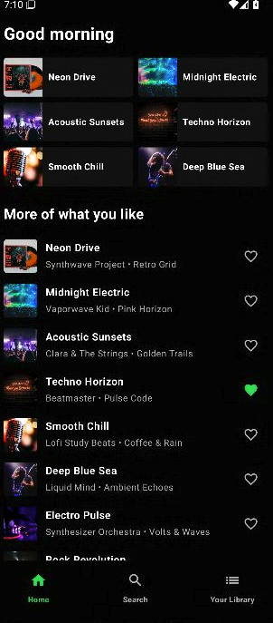
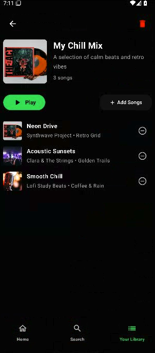
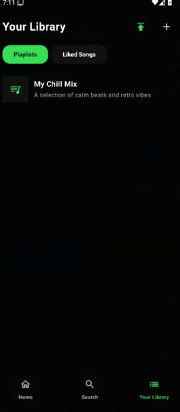

# Vyb - Sleek Android Music Player

Vyb is a premium, offline-first music streaming and local playback application for Android. Built with a gorgeous, dark-themed user interface inspired by modern streaming apps, Vyb delivers an immersive audio experience with advanced playlist management, intelligent metadata extraction, local file importing, and a robust offline database.

---

## 📱 Screenshots Gallery

Below are the screenshots showcasing the application's beautiful visual design, cohesive color palette, and streamlined user flows:

| **Home Dashboard** | **Smart Playlists** | **Your Library** |
| :---: | :---: | :---: |
|  |  |  |
| Elegant, responsive dashboard with a dynamic greeting, custom quick-access grid, and personalized recommendations. | Interactive playlist management. Add, remove, and sort tracks. Full custom play queues with beautiful card layouts. | Easily organize your musical collection. Search your local index and navigate with custom Material 3 tabs. |

---

## ✨ Features

- 🎧 **Sleek, High-Contrast UI**: Beautiful Spotify-inspired Material 3 dark mode featuring vibrant dynamic color accents (Spotify Green) and smooth motion transitions.
- 🌈 **Dynamic Brand Accents**: Personalize the entire app theme with gorgeous custom accents—choose between *Sunset Amber*, *Emerald Glow*, *Cosmic Blue*, *Neon Purple*, *Cyberpunk Coral*, *Claude Clay*, and *Claude Apricot*.
- 🏝️ **Custom Floating Dynamic Island**: A system-level heads-up overlay that displays track information and playback controls on top of other applications.
  - **Behavior Modes**: Switch between *Compact Pill* (small, unobtrusive), *Expanded Card* (always showing full control details), and *Auto-expanding* (expands on long-press).
  - **Background Transparency**: Features a dynamic opacity slider ranging from 30% to 100% to control focus and visibility.
  - **System Overlay Integration**: Safe permission check with automated setup guides.
- 📊 **Fluid Live Audio Equalizer Waveform**: An animated, 4-bar reactive visualizer built directly into the Compact Pill state of the Dynamic Island. Bars oscillate and dance in real-time when music plays, matching the active brand accent color, and flatten gracefully when paused.
- 🎛️ **High-Fidelity 5-Band Equalizer & Spatial Effects**:
  - **Interactive Vertical EQ Sliders**: Custom-built vertical sliders representing different frequency bands (60Hz, 230Hz, 910Hz, 4kHz, 14kHz) with center (0dB) notch reference lines, smooth high-precision tap & drag gesture detection, and dynamic color progress tracking.
  - **Tactile Rotary Knobs**: Modern rotary knobs custom-drawn on Canvas with rotating pointer indicators and outer glow boundaries for smooth physical control of **Deep Bass Boost** and **Spatial 3D Surround** depth.
  - **Acoustic Presets**: Quick tap-to-apply preset configurations (like Normal, Classical, Dance, Flat, Folk, Heavy Metal, Hip Hop, Jazz, Pop, Rock) that automatically adjust frequency bands and update the visual sliders.
- ⏱️ **Interactive Sleep Timer**: Set a time limit for your session using a custom slider (1 to 120 minutes). Features a monospace visual active countdown (`MM:SS`) with a depleting progress bar and convenient quick-extension triggers (`+5m`, `+10m`, `+15m`).
- 📈 **Smart Insights & Statistics Dashboard**: Full-featured local analytics tracker parsing your total listening time (seconds), top genres, top artists, and top-played tracks based on real-time activity.
- 📂 **Intelligent Local Folder Importing & Auto-Grouping**: 
  - Effortlessly import individual `.mp3` files or entire physical folder structures recursively.
  - Automatically parses track title, artist, album, duration, and genre metadata using advanced `MediaMetadataRetriever` extraction.
  - Safely clones files into the app's secure sandbox storage directory for reliable, continuous offline access.
  - Maintains physical directory names and structures in a dedicated **Smart Folders** library tab.
  - Dynamic **Auto-Grouping**: Automatically organizes and filters your local collection on-the-fly into "Smart Folders" grouped by **Physical Directory**, **Artist Tag**, **Genre**, or **Import Date** ("Today", "This Week", "This Month", etc.).
- 💾 **Smart Playlist Engine & Library**:
  - Organize your tracks into custom playlists with custom titles and descriptions.
  - Dynamic interactive play queue: play, pause, shuffle, and skip seamlessly.
  - Fully integrated offline Favorites synchronization.
- 🎛️ **Persistent Bottom Playback Bar**:
  - Always-visible persistent playback strip at the bottom of the screen.
  - Direct controls for Play/Pause, Skip Forward, and Skip Backward.
  - Fully interactive progress bar/slider to easily scrub and seek to any position in the track.
- 🔍 **Real-Time Universal Search**: Multi-field querying filters your entire library by track title, artist, album, or genre instantly.
- 📦 **Offline-First Room Persistence**: Powered by SQLite & Jetpack Room, your playlists, liked status, track queue, and imported audio files persist perfectly across app restarts.

---

## 🛠️ Tech Stack & Architecture

Vyb represents modern Android development practices:

- **Language**: 100% Kotlin with asynchronous structured concurrency via Coroutines and Flow.
- **User Interface**: **Jetpack Compose** with Material Design 3, dynamic theming, edge-to-edge window insets, and rigorous touch-target accessibility.
- **Architecture**: Clean Architecture conforming to the **MVVM (Model-View-ViewModel)** design pattern for pristine separation of concerns.
- **Database Persistence**: **Room Database** with Kotlin Symbol Processing (KSP) for lightweight, compile-safe local SQL caching.
- **Audio Playback Engine**: Custom stateful Android ExoPlayer wrapper ensuring high-fidelity hardware decoding and background playback compatibility.
- **Testing**: Complete JVM local test coverage using **Robolectric** for context validation and **Roborazzi** for pixel-perfect screenshot visual regression tests.

---

## 🚀 Getting Started

### Prerequisites

- **Android Studio** Ladybug (or newer)
- **Android SDK** 34+
- **JDK** 17+

### Running the App

1. Clone or download the project workspace ZIP.
2. Open the project in Android Studio.
3. Sync the Gradle configuration files.
4. Run the `:app` module on a modern Android device or emulator.

### How to Import Local Music

1. Navigate to the **Your Library** or **Home** screen.
2. Tap the **Import** button (indicated by the upload/publish icon `Publish`).
3. Select any `.mp3` or compatible audio file from your device's storage.
4. Vyb will copy the file, extract its metadata, and automatically insert it into your playable library list!

---

## 📂 Project Structure

```text
/app/src/main/java/com/example/
├── MainActivity.kt          # Main UI entry point, Scaffold, and Screen compositions
├── data/
│   ├── MusicDatabase.kt     # Room SQLite Database initialization
│   ├── TrackDao.kt          # Data Access Object for local track indexing
│   └── TrackEntity.kt       # Local Database Track entity definition
├── player/
│   └── AudioPlayerManager.kt# ExoPlayer lifecycle & hardware playback coordinator
└── viewmodel/
    └── MusicViewModel.kt    # State machine coordinating UI flows, queries, and file importing
```

---

## 🧪 Running Automated Tests

To maintain premium quality and prevent regressions, Vyb includes fully automated JVM tests:

```bash
# Run local JVM unit and integration tests (Robolectric)
gradle :app:testDebugUnitTest

# Verify UI layouts and screenshot visuals (Roborazzi)
gradle :app:verifyRoborazziDebug

# Record new visual screenshots after modifying Compose components
gradle :app:recordRoborazziDebug
```

---

*Enjoy a clean, fast, and gorgeous listening experience with **Vyb**!*
